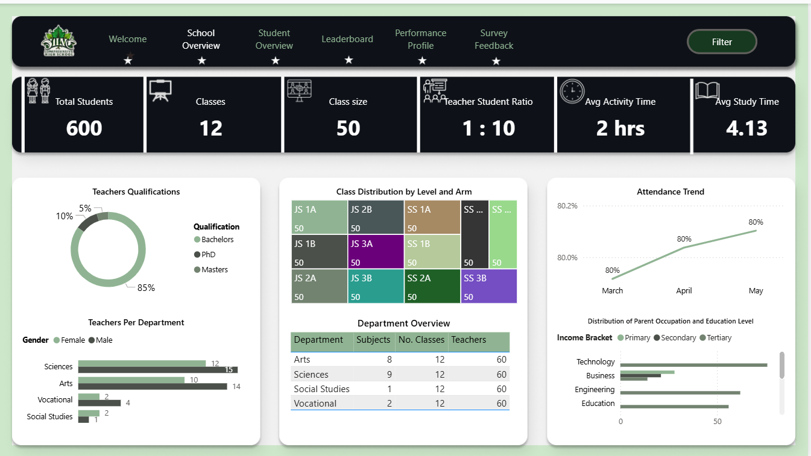

# 🎓 **Data-Driven Education Intelligence Platform | Predictive Analytics, Data Engineering, and Power BI Insights for Academic Performance Improvement in Africa**

## 🚀 Executive Summary  

The **DataFest Africa Hackathon 2024** challenged participants to design data-driven solutions to improve **secondary school academic outcomes** across Africa.  
Our team, **Data Titans**, developed a **comprehensive data intelligence platform** for **Vine Comprehensive High School**, aimed at helping educators, administrators, and policymakers proactively improve students’ academic performance.  

With over **76% of Nigerian students scoring below 200 (50%) in the 2024 UTME**, our mission was clear:  
> **Use data analytics, machine learning, and automation to empower schools with actionable insights that improve academic outcomes before exams happen.**

💡 **Key Highlights**
- Built a **predictive model** that forecasts a student’s likelihood of passing or failing, with **87% accuracy**.  
- Designed an **end-to-end enterprise data solution** — from data collection to warehousing and reporting — using **Airbyte, dbt, BigQuery, and Power BI**.  
- Identified **key factors beyond academics** (such as attendance, study habits, and socio-economic context) influencing student performance.  
- Delivered a **Power BI dashboard** and **reporting solution** enabling stakeholders to make informed, data-backed decisions.  

---

🏆 **Competition Achievement**

Our solution ranked **7th place out of over 100 competing teams** at **DataFest Africa Hackathon 2024**, demonstrating the strength of our technical execution, innovative approach, and real-world applicability.

---

---

## 🧩 Business Problem  

Education stakeholders and guardian across Africa face an urgent challenge: **students consistently underperform in national exams**, despite significant investment in learning materials and teaching.  
The absence of structured data systems prevents schools from identifying performance gaps early or addressing the root causes of failure.

### Key Questions
- What factors most influence student performance across schools and subjects?  
- Can we predict which students are at risk of failure before exams?  
- How can school management track, analyze, and improve academic outcomes using data?  

---

## 🧠 Methodology  

Our approach followed a **Data Science + Data Engineering + Business Intelligence** pipeline:

| Step | Description | Tools Used |
|------|--------------|------------|
| **1. Data Generation** | Designed and simulated realistic student datasets reflecting African education ecosystems (attendance, socio-economic data, study habits, etc.). | Python(Faker), Excel |
| **2. Data Engineering** | Built a data architecture with automated ingestion, transformation, and storage pipelines. | Airbyte, dbt, BigQuery, SQL |
| **3. Data Modeling** | Created relational models linking student performance, demographics, and engagement. | SQL, dbt |
| **4. Predictive Analytics** | Developed a machine learning model to predict pass/fail outcomes based on multiple academic and behavioral factors. | Python (scikit-learn, Pandas, NumPy) |
| **5. Visualization & Reporting** | Designed an executive-level Power BI dashboard and detailed insights report. | Power BI, DAX, Power Query |

---

## 🧰 Skills & Tools  

### 🗄️ **Data Engineering**
- **Airbyte:** Automated ingestion from multiple sources.  
- **dbt:** Data transformation and orchestration.  
- **BigQuery / SQL:** Cloud warehousing, CTEs, joins, data modeling.  

### 🤖 **Data Science**
- **Python:** Pandas, NumPy, Scikit-learn.  
- **Machine Learning Techniques:** Logistic Regression, Decision Trees, Model Evaluation.  

### 📊 **Business Intelligence**
- **Power BI:** DAX calculations, KPI dashboards, drill-through reports.  
- **Power Query:** Data shaping, merging, transformation.  

### ⚙️ **Other Skills**
- Data Pipeline Automation  
- ETL/ELT Framework Design  
- Business Requirements Documentation  
- Insight Storytelling  

---

## 📈 Results & Key Insights  

| Finding | Impact |
|----------|---------|
| **Socio-economic background and attendance were top predictors of performance** | Informed targeted scholarship and mentorship programs. |
| **Students who engaged in consistent mock tests had 40% higher pass rates** | Led to policy on structured assessment schedules. |
| **Predictive model achieved 87% accuracy** | Enabled early identification and support for at-risk students. |
| **Automated reporting reduced manual analysis time by 60%** | Freed up educators’ time for student-focused initiatives. |

> 🎯 **Recommendation:**  
> Schools should invest in data collection infrastructure, encourage consistent internal testing, and use predictive insights to provide timely academic interventions.  

---

### 🖥️ Dashboard Preview  

  

---

### 📑 Insights Report  

  

---

## 🔮 Next Steps  

If given more time, we would:  
- Integrate **real-time data collection** from student management systems and digital learning platforms.  
- Build a **Student Success API** for continuous prediction updates.  
- Expand the model to include **sentiment and behavioral data** (e.g., teacher feedback, extracurricular engagement).  
- Develop a **school-wide data literacy program** to help educators interpret and act on data insights.  

> 🌍 **Long-Term Vision:**  
> Build a continent-wide data-driven education framework — empowering African schools to use analytics for policy-making, learning optimization, and equitable student success.

